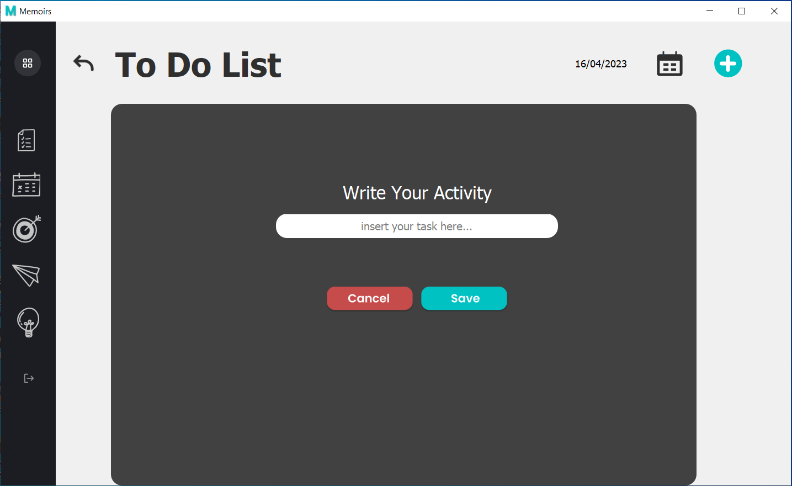

# MEMOIRS


## Deskripsi singkat
Memoirs adalah aplikasi yang dibuat untuk memungkinkan pengguna mencatat rencana kegiatan harian dan menulis jurnal harian. Secara spesifik, aplikasi ini dapat digunakan oleh pengguna untuk menjadwalkan rencana kegiatan sehari-hari dan menuliskan perasaan pengguna ataupun yang disyukuri pada hari tersebut. aplikasi ini juga dapat membantu pengguna mencatat target, mimpi, dan cita-cita dalam jangka waktu yang panjang. Untuk menunjang produktivitas pengguna, aplikasi ini juga menyediakan artikel yang berisi tips dan trik untuk berperilaku produktif.


## Cara menjalankan aplikasi
1. Clone repositori ini dengan memasukkan script berikut pada terminal
```
git clone -b main https://gitlab.informatika.org/maikeljh/if2250-2023-k02-g10-memoirs.git
```
2. Install requirement dengan memasukkan script berikut pada terminal
```
pip install -r requirements.txt
```
3. Jalankan program main dari direktori utama
```
python src/main.py
```
4. Aplikasi siap digunakan


## Daftar modul yang digunakan
1. AuthHandler
    * 
    * 
    * Modul ini merupakan realisasi dari use case manajemen passcode.
    * Pengguna baru dapat melakukan registrasi passcode kemudian login ke dalam aplikasi.
    * Author: Michael Jonathan Halim (13521124)
2. To-Do List
    * 
    * 
    * 
    * Modul ini merupakan realisasi dari use case melihat dan mengelola to-do list.
    * Pada modul ini, pengguna dapat;
        * Menambahkan to-do list baru
        * Melihat to-do list yang telah dibuat
        * Mengedit to-do list yang telah dibuat
        * Menghapus to-do list yang telah dibuat
    * Author: Febryan Arota Hia (13521120)
3. Catatan Harian (Daily Plan)
    * 
    * 
    * 
    * Modul ini merupakan realisasi dari use case melihat dan mengelola catatan harian. Modul ini menyediakan fitur untuk merencanakan kegiatan yang ingin dilakukan pada tanggal dan jam yang diinginkan pengguna.
    * Pada modul ini, pengguna dapat;
        * Menambahkan catatan harian baru
        * Melihat catatan harian yang telah dibuat
        * Mengedit catatan harian yang telah dibuat
        * Menghapus catatan harian yang telah dibuat
    * Author: Kevin John Wesley Hutabarat (13521042)
4. Catatan target (Targets)
    * 
    * 
    * 
    * Modul ini merupakan realisasi dari use case melihat dan mengelola catatan target. Catatan target dapat berisi target, mimpi, maupun cita-cita pengguna pada tanggal tertentu.
    * Pada modul ini, pengguna dapat;
        * Menambahkan catatan target baru
        * Melihat catatan target yang telah dibuat
        * Mengedit catatan target yang telah dibuat
        * Menghapus catatan target yang telah dibuat
    * Author: Ryan Samuel Chandra (13521140)
4. Catatan syukur (Gratitude journal)
    * 
    * 
    * 
    * Modul ini merupakan realisasi dari use case melihat dan mengelola catatan syukur. Catatan syukur berisi hal-hal yang disyukuri pengguna pada saat pengguna menuliskan catatan syukur.
    * Pada modul ini, pengguna dapat;
        * Menambahkan catatan syukur baru
        * Melihat catatan syukur yang telah dibuat
        * Mengedit catatan syukur yang telah dibuat
        * Menghapus catatan syukur yang telah dibuat
    * Author: Haziq Abiyyu Mahdy (13521170)
5. Artikel (Article)
    * 
    * 
    * Modul ini merupakan realisasi dari use case melihat dan artikel. Artikel sudah disediakan oleh aplikasi dan konten artikel pada umumnya berhubungan dengan produktivitas.
    * Pada modul ini, pengguna dapat melihat artikel
    * Author: Michael Jonathan Halim (13521124)


## Daftar Tabel Basis Data
| Nama Tabel | Atribut | <i>Type</i> | <i>Constraint</i> | <i>KEY</i>
| :---: | --- | --- | --- | ---
| `passcode` | passcode | CHAR(6) | - | PRIMARY KEY
| `article` | title<br/>content<br/>image | VARCHAR(100)<br/>VARCHAR(5000)<br/>VARCHAR(100) | -<br/>NOT NULL<br/>NOT NULL | PRIMARY KEY<br/>-<br/>-
| `to_do_list` | to_do<br/>tanggal<br/>done | VARCHAR(105)<br/>VARCHAR(100)<br/>INT | -<br/>-<br/>DEFAULT 0 | PRIMARY KEY<br/>PRIMARY KEY<br/>-
| `catatan_harian` | tanggal<br/>jam_mulai<br/>jam_berakhir<br/>nama_kegiatan | VARCHAR(100)<br/>VARCHAR(100)<br/>VARCHAR(100)<br/>VARCHAR(40) | -<br/>-<br/>-<br/>- | PRIMARY KEY<br/>PRIMARY KEY<br/>PRIMARY KEY<br/>PRIMARY KEY
| `catatan_target` | target<br/>tanggal | VARCHAR(1000)<br/>VARCHAR(100) | -<br/>- | PRIMARY KEY<br/>PRIMARY KEY
| `catatan_syukur` | syukur<br/>tanggal | VARCHAR(1000)<br/>VARCHAR(100) | -<br/>- | -<br/>PRIMARY KEY

